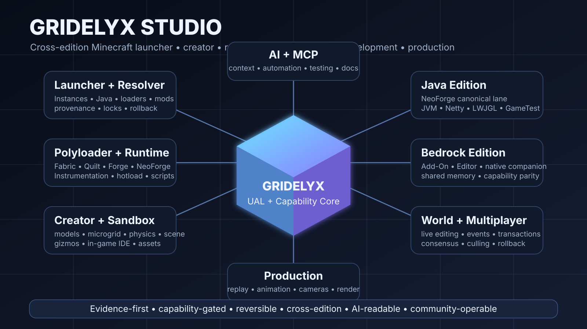

# Gridelyx

<p align="center">
  
</p>

<p align="center">
  <a href="docs/PROJECT_OVERVIEW.md"></a>
  <a href="docs/FEATURE_MAP.md"></a>
  <a href="docs/CHAT_REQUIREMENTS_TRACEABILITY.md"></a>
  <a href="docs/community/TESTING_AND_EVIDENCE.md"></a>
  <a href="docs/DEPENDENCIES_AND_TOOLCHAIN.md"></a>
  <a href="docs/DEPENDENCIES_AND_TOOLCHAIN.md"></a>
  <a href="docs/AI_CONTEXT_SYSTEM.md"></a>
  <a href="docs/ADVANCED_ENGINES.md"></a>
</p>

**Gridelyx** is the root brand for an experimental cross-edition Minecraft launcher, development environment, creator/sandbox engine, world editor, modding interoperability layer and machinima/production suite. The integrated product is **Gridelyx Studio**.

## 3-bullet value proposition

- **One cross-edition creation platform:** launcher/instance management, dependency resolution, Polyloader/UAL interoperability, live world and asset authoring, scripting/native bridges, Java + Bedrock adapters and production tooling share one capability model.
- **Develop inside the living game:** Gridelyx targets edit → compile/script → hotload → inspect → test loops with in-game IDE/AI control, transactional world mutation, multiplayer-aware authoring and restart minimisation rather than defaulting to alt-tab/restart cycles.
- **Ambitious without hiding uncertainty:** every capability is tied to retained CR requirements, dependencies, target fingerprints, rollback and R0-R6 evidence so stakeholders can distinguish vision, framework, tested behavior and release readiness.

> **Evidence rule:** source or an interface existing does not mean a capability is production-ready. Gridelyx uses R0-R6 readiness and target-specific validation. See [`docs/FEATURE_MAP.md`](docs/FEATURE_MAP.md) and [`docs/CHAT_REQUIREMENTS_TRACEABILITY.md`](docs/CHAT_REQUIREMENTS_TRACEABILITY.md).

### At-a-glance project views

- **Stakeholder dashboard / Kanban:** [`docs/STAKEHOLDER_DASHBOARD.md`](docs/STAKEHOLDER_DASHBOARD.md)
- **Architecture diagrams as code:** [`docs/ARCHITECTURE_DIAGRAMS.md`](docs/ARCHITECTURE_DIAGRAMS.md)
- **User journeys:** [`docs/USER_JOURNEYS.md`](docs/USER_JOURNEYS.md)
- **Impact-effort matrix:** [`docs/IMPACT_EFFORT_MATRIX.md`](docs/IMPACT_EFFORT_MATRIX.md)
- **Technical documentation site:** [`mkdocs.yml`](mkdocs.yml) / [`docs/index.md`](docs/index.md)
- **Interactive API docs:** [`docs/api/index.md`](docs/api/index.md)
- **Release notes / changelog:** [`docs/RELEASE_NOTES_AND_CHANGELOGS.md`](docs/RELEASE_NOTES_AND_CHANGELOGS.md) / [`CHANGELOG.md`](CHANGELOG.md)
- **Labels and filtering:** [`docs/LABELS_AND_FILTERING.md`](docs/LABELS_AND_FILTERING.md)
- **Documentation-driven marketing:** [`docs/DOCUMENTATION_DRIVEN_MARKETING.md`](docs/DOCUMENTATION_DRIVEN_MARKETING.md)

This repository is deliberately broader than a normal mod. It contains the launcher/resolver control plane, canonical Java mod-development template, advanced runtime frameworks, Bedrock targets, native bridges, cross-language adapters, AI/project-intelligence tooling, production foundations and the project-management/evidence system required to develop them coherently.

## Start here

For humans:

1. [`docs/index.md`](docs/index.md) — documentation portal.
2. [`docs/STAKEHOLDER_DASHBOARD.md`](docs/STAKEHOLDER_DASHBOARD.md) — bird's-eye program state.
3. [`COMMUNITY.md`](COMMUNITY.md) — community entrypoint.
4. [`docs/community/GETTING_STARTED.md`](docs/community/GETTING_STARTED.md) — setup and first validation.
5. [`CONTRIBUTING.md`](CONTRIBUTING.md) — contribution workflow.
6. [`docs/community/ARCHITECTURE_TOUR.md`](docs/community/ARCHITECTURE_TOUR.md) — subsystem map.
7. [`docs/community/TESTING_AND_EVIDENCE.md`](docs/community/TESTING_AND_EVIDENCE.md) — what counts as evidence.
8. [`docs/DEPENDENCIES_AND_TOOLCHAIN.md`](docs/DEPENDENCIES_AND_TOOLCHAIN.md) — required/optional tools and programs.
9. [`docs/FEATURE_DECISION_FRAMEWORK.md`](docs/FEATURE_DECISION_FRAMEWORK.md) — mandatory substantial-feature analysis process.
10. [`docs/DEVELOPMENT_MAP.md`](docs/DEVELOPMENT_MAP.md) — critical path, work lanes, horizons and Kanban state.
11. [`docs/BENCHMARKING_MATRIX.md`](docs/BENCHMARKING_MATRIX.md) — comparison targets and benchmark workflow.

For AI/agent work:

1. [`AGENTS.md`](AGENTS.md)
2. [`AI_HANDOFF.md`](AI_HANDOFF.md)
3. [`docs/CHAT_REQUIREMENTS_TRACEABILITY.md`](docs/CHAT_REQUIREMENTS_TRACEABILITY.md)
4. [`docs/FEATURE_DECISION_FRAMEWORK.md`](docs/FEATURE_DECISION_FRAMEWORK.md)
5. [`platform/chat-requirements.json`](platform/chat-requirements.json)
6. [`platform/feature-analysis.schema.json`](platform/feature-analysis.schema.json)
7. [`platform/toolchain-requirements.json`](platform/toolchain-requirements.json)
8. [`vault/manifest.json`](vault/manifest.json)
9. [`ai/context-map.json`](ai/context-map.json)
10. [`platform/portfolio-board.json`](platform/portfolio-board.json)
11. [`ai/work-state.json`](ai/work-state.json), [`ai/decision-ledger.json`](ai/decision-ledger.json) and [`ai/assumption-ledger.json`](ai/assumption-ledger.json)

## Canonical identity

- Root brand: **Gridelyx**
- Integrated suite: **Gridelyx Studio**
- Product/API slug target: `gridelyx`
- Requested GitHub repository slug: `gridlyx`
- Protocol prefix target: `GLYX`
- Executable target: `gridelyx`

Machine-readable identity: [`platform/brand.json`](platform/brand.json). Requested GitHub metadata: [`platform/repository-metadata.json`](platform/repository-metadata.json).

Versioned compatibility identifiers may remain at explicit migration boundaries while old saves/protocols/ABIs are supported, but they do not change the canonical Gridelyx product identity. Compatibility changes require migration tests rather than blind text replacement.

## What Gridelyx is intended to provide

### Launcher and instance platform

Gridelyx Studio is designed to start without requiring Java merely to open the desktop application. For Java Edition instances it will resolve/acquire the appropriate Java runtime, Minecraft version, loader, libraries, assets and content graph through legitimate/authorized channels.

Target loader/content support includes vanilla, Fabric, Quilt, Forge, NeoForge, extensible legacy/future loader adapters, Modrinth, authorized CurseForge access, resource/shader/datapacks/worlds, deterministic dependency resolution, hashes/provenance/content locks, isolated instances, snapshots/clone/fork/diff/import/export and both simple and expert UX. Provider policy is in [`studio/providers/providers.json`](studio/providers/providers.json) and [`docs/ACQUISITION_AND_RESOLUTION.md`](docs/ACQUISITION_AND_RESOLUTION.md).

### Java creator/runtime plane

The current NeoForge 26.2 template is the canonical validated construction target, while the architecture is designed to become version/loader-neutral through Polyloader/UAL adapters.

Advanced frameworks include Java Instrumentation and compatible HotSwap, ASM runtime transformation, dynamic Mixin/redirector infrastructure, Reflection/MethodHandles, direct Java source-string compilation, NIO.2 hotload monitoring, replaceable classloader/services, bounded worker pools, GraalVM JavaScript/Python, MCP/local vector indexing, Netty development/edit channels, shared-memory IPC and FFM/Panama, Rust/C++ native extensions, Python/Go/C# sidecars, LWJGL/GPU buffer frameworks, profiling, telemetry and chaos-engineering foundations.

### Polyloader / UAL

Gridelyx aims to sit both **below and above** ordinary Java loader APIs through prelaunch bootstrap/instrumentation where required, neutral UAL operations, loader-family adapters and bytecode-call translation, runtime environment/fingerprint scanning, isolated sideload containers, virtual/indirected definitions and explicit live-safe/emulated/prelaunch-required/unsupported capability states.

Cross-loader execution is a target, not an automatic compatibility claim. See [`docs/POLYLOADER_ARCHITECTURE.md`](docs/POLYLOADER_ARCHITECTURE.md).

### Live world editing and procedural events

Frameworks exist for parallel section-array blitting, asynchronous sub-chunk computation, authoritative server-thread commits, controlled bulk-lighting reconciliation, `.nbt` blueprint loading, Dynamic Event and Structure Matrix triggers, editing already-generated terrain, transactional rollback foundations, multiplayer revisions/consensus/culling and volumetric client-preview streams.

Planned extensions explicitly include Terraria-style Dynamic Liquid Simulation Cells, arbitrary block/face paint and sub-voxel overlay matrices, and progression-locked/reversible world-transmutation states.

### Creator, geometry and sandbox systems

The retained creator target combines dynamic model/texture registries, live mesh/voxel/texture editing, microgrid/sub-voxel placement, circles/cylinders/curves/slopes/slanted blocks, custom rendering and dynamic collision/hitboxes, deeper collision/renderer augmentation when necessary, scene graph/properties/transform gizmos, physically manipulable entities/parts, custom physics/constraints, weld/hinge/slider/spring/rope construction, raycast tool-gun controls and in-game IDE/console/keybind/AI automation.

### Non-Java modification gateway

Other tools are intended to extend the game through permissioned Gridelyx capability surfaces: embedded JavaScript/Python via GraalVM, external Python, Go, C#/.NET, Rust/C++, MCP, Netty/TCP/HTTP where appropriate, shared-memory IPC, native FFM/Panama bridges, filesystem hotload, Bedrock Script/Editor adapters and future versioned patch modules. A connected external tool does not automatically gain world/server authority.

### Anti-crash / fault containment

Gridelyx uses layered containment rather than claiming impossible crash immunity: bounded asynchronous execution, budgets/timeouts, deny-by-default scripting capabilities, process isolation for crash-prone/untrusted/native workloads, global recovery boundaries, transactional world edits and rollback/WAL, last-known-good hotload state, crash attribution and supervised restart. Fatal same-process native corruption or JVM OOM cannot be guaranteed recoverable; those failure modes require process isolation/recovery design.

### Bedrock plane

The repository includes Bedrock behavior/resource packs, Preview Editor target, Bedrock capability manifest, Java FFM/Panama bridge classes, native companion code and shared-memory/framed bridge foundations. Gridelyx targets feature parity where technically achievable while recording real parity gaps. Unsupported Bedrock API surfaces may require deeper version/fingerprint-gated integration; no undocumented technique is advertised as universally stable.

### Recording, animation and production

Gridelyx Production retains deterministic replay/event logging, rational-time timelines, camera tracks/rigs, actor transform/animation/pose/IK tracks, shots/takes/sequences/cues, real-time capture, offline deterministic rendering where target stepping permits it, image sequences, replaceable encoder bridge, audio stems/mix metadata and advanced render-pass research. See [`docs/MACHINIMA_PRODUCTION.md`](docs/MACHINIMA_PRODUCTION.md).

## Advanced feature planning and decision system

Substantial Gridelyx features use the **Feature Decision Packet** in [`docs/FEATURE_DECISION_FRAMEWORK.md`](docs/FEATURE_DECISION_FRAMEWORK.md). It includes W5x5x5 repeated Who/What/When/Where/How/Why and inverse analysis, task decomposition, project-values checks, cost/time/money/energy diagnostics, 10-minute through 10-year horizons, opportunity cost, regret minimisation, reversibility, risk, inversion, second-order thinking, overlap/Venn analysis, Eisenhower classification, first principles, benchmarking, Feynman explanation, MVP, timeboxing, pre-mortem, asymmetric risk, working backward, Pareto/80-20, Critical Path Method, Cynefin and Kanban.

This machinery guides sequencing and architecture. It does not erase a retained feature merely because its cost is high. Machine contract: [`platform/feature-analysis.schema.json`](platform/feature-analysis.schema.json); issue intake: [`.github/ISSUE_TEMPLATE/feature-evaluation.yml`](.github/ISSUE_TEMPLATE/feature-evaluation.yml).

## Stakeholder, documentation and release communication system

CR-035 keeps the project understandable at multiple depths:

- source-controlled hero/concept SVG and Shields.io parameter badges;
- stakeholder dashboard and machine-readable portfolio Kanban;
- Mermaid architecture, user-journey and impact-effort diagrams as code;
- MkDocs + Material technical documentation site;
- OpenAPI 3.1 + embedded Swagger UI for interactive API documentation;
- machine-readable GitHub label taxonomy and manual least-privilege sync workflow;
- deterministic changelog generation;
- optional AI-assisted release-note synthesis constrained to deterministic evidence and human review;
- claim-to-proof documentation-driven marketing rules.

See [`docs/DOCUMENTATION_TOOLCHAIN.md`](docs/DOCUMENTATION_TOOLCHAIN.md) for the pinned docs stack and supply-chain boundaries.

## Project control and whole-chat scope

The complete retained conversation scope is not left in chat history. It is recorded in:

- [`docs/CHAT_REQUIREMENTS_TRACEABILITY.md`](docs/CHAT_REQUIREMENTS_TRACEABILITY.md) — human-readable CR ledger;
- [`platform/chat-requirements.json`](platform/chat-requirements.json) — machine-readable requirements/evidence paths;
- [`tools/chat_requirements_check.py`](tools/chat_requirements_check.py) — CI validation;
- [`docs/TODO.md`](docs/TODO.md) — live implementation ledger;
- [`docs/ROADMAP.md`](docs/ROADMAP.md) — staged sequencing;
- [`docs/DEVELOPMENT_MAP.md`](docs/DEVELOPMENT_MAP.md) — critical path, lanes, horizons and Kanban;
- [`docs/FEATURE_MAP.md`](docs/FEATURE_MAP.md) — evidence/readiness state;
- [`docs/PROJECT_PLAN.md`](docs/PROJECT_PLAN.md) — governance/program plan;
- [`docs/PROJECT_VALUES.md`](docs/PROJECT_VALUES.md) — decision invariants;
- [`docs/FEATURE_DECISION_FRAMEWORK.md`](docs/FEATURE_DECISION_FRAMEWORK.md) — feature evaluation method;
- [`docs/STAKEHOLDER_DASHBOARD.md`](docs/STAKEHOLDER_DASHBOARD.md) / [`platform/portfolio-board.json`](platform/portfolio-board.json) — executive portfolio view.

A future contributor/AI may not silently remove a requested capability merely because it is difficult or not supported by a normal mod API. The integration level and validation burden change; the requirement remains until explicitly superseded.

## Dependencies and tools

Canonical dependency documentation: [`docs/DEPENDENCIES_AND_TOOLCHAIN.md`](docs/DEPENDENCIES_AND_TOOLCHAIN.md). Documentation-specific tools are in [`docs/DOCUMENTATION_TOOLCHAIN.md`](docs/DOCUMENTATION_TOOLCHAIN.md).

Current locked Java lane:

- Minecraft `26.2` template target;
- NeoForge `26.2.0.67`;
- ModDevGradle `2.0.144`;
- Gradle `9.2.1`;
- Eclipse Temurin Java `25.0.4+7` / language 25;
- Spotless `8.10.0`;
- Checkstyle `14.0.0`;
- JUnit `6.1.3`;
- ArchUnit `1.4.2`;
- ASM `9.10.1`;
- LWJGL `3.4.1` reference modules;
- GraalVM Polyglot `25.3.4.1`.

Documentation lane:

- MkDocs `1.6.1`;
- Material for MkDocs `9.7.7`;
- mkdocs-swagger-ui-tag `0.8.0`;
- Mermaid browser asset `11.17.2`.

Additional subsystem tools include Python, Rust/Cargo, CMake/C++ compiler, optional Go/.NET bridge toolchains, optional Dev Containers, external encoder/decompiler adapters and Bedrock target runtimes. Their exact pin/support state is machine-readable in [`platform/toolchain-requirements.json`](platform/toolchain-requirements.json).

## Public dependency acquisition

The public Gridelyx source repository stores **our source and acquisition metadata, not upstream runtime/toolchain payloads**.

- GitHub Actions dynamically installs Temurin JDK 25 and Gradle 9.2.1 through [`.github/actions/gridelyx-toolchain/action.yml`](.github/actions/gridelyx-toolchain/action.yml).
- NeoForge ModDevGradle resolves Minecraft, NeoForge, mappings and the development runtime into local/runner Gradle caches.
- Gradle/Maven resolves LWJGL, ASM, GraalVM, JUnit, ArchUnit and other declared Java dependencies.
- [`vault/manifest.json`](vault/manifest.json) records canonical providers, versions, resolver strategy and the optional pinned NeoForge MDK revision; it contains no upstream binary payload.
- [`tools/hydrate_references.py`](tools/hydrate_references.py) can optionally clone that pinned MDK into ignored `.reference-cache/` for comparison/provenance.
- [`tools/redistribution_guard.py`](tools/redistribution_guard.py) scans the actual Git index and rejects tracked JARs, class files, archives, native binaries, installers, chunked payloads and upstream reference trees.

Acquiring an upstream dependency into a developer/runner/user cache is not the same as redistributing it from this repository. Provider licenses and terms still apply to each dependency.

## Core validation commands

```bash
python tools/continuity_check.py
python tools/chat_requirements_check.py
python tools/toolchain_requirements_check.py
python tools/feature_planning_check.py
python tools/docs_check.py
python tools/terminology_check.py
python tools/hydrate_references.py --check
python tools/redistribution_guard.py
python tools/studio_check.py
python tools/validate_platform.py
python tools/diagnose.py --static
python tools/repo_index.py --check
cargo test --manifest-path studio/Cargo.toml --all-targets
mkdocs build --strict
```

Then run subsystem-specific Java, native, Bedrock, GameTest and interactive validation required by the files changed.

## Community and security

- [`COMMUNITY.md`](COMMUNITY.md)
- [`CONTRIBUTING.md`](CONTRIBUTING.md)
- [`CODE_OF_CONDUCT.md`](CODE_OF_CONDUCT.md)
- [`SUPPORT.md`](SUPPORT.md)
- [`SECURITY.md`](SECURITY.md)
- [`docs/LICENSING_REQUIREMENTS.md`](docs/LICENSING_REQUIREMENTS.md)

Gridelyx is not affiliated with or endorsed by Mojang/Microsoft, NeoForged, Fabric, Quilt, Forge, Modrinth, CurseForge, Hytale, Garry's Mod/Facepunch or Roblox. Those names are used only to describe comparison targets or external ecosystems.
