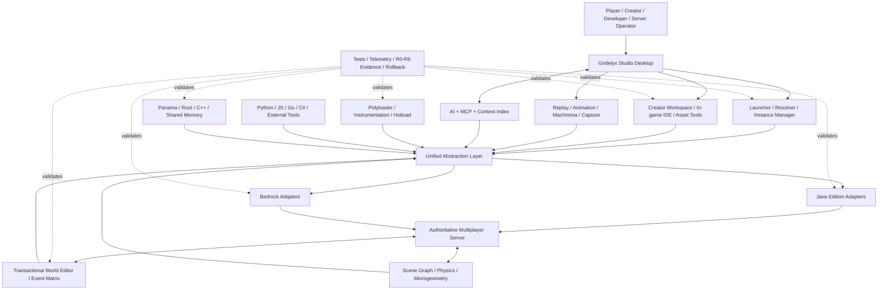

# Gridelyx diagrams as code

This is the canonical visual architecture entrypoint. Visuals are stored as text so they are reviewable, diffable and AI-readable. A diagram is explanatory evidence, not runtime evidence; R0-R6 claims still come from the relevant tests and target validation.

## Platform architecture

Source: `diagrams/platform-architecture.mmd`.

## Architecture reading rules

1. **UAL is a contract boundary, not magic compatibility.** Loader/edition adapters must prove actual mappings and behavior.
2. **Authoritative mutations remain server-controlled.** AI, in-game editors and external tools request capabilities; connection is not authority.
3. **Native and deep integration remain capability-gated.** Version/fingerprint validation and rollback are required.
4. **Worker threads compute; controlled target threads commit.** World/render/network state follows each engine's thread ownership model.
5. **Evidence is cross-cutting.** A feature moves from planned/framework to target-supported only through the matching validation lane.

## Diagram inventory

| Diagram | Source | Purpose |
|---|---|---|
| Platform architecture | `diagrams/platform-architecture.mmd` | System boundaries and data/control planes |
| User journey | `diagrams/user-journey.mmd` | Experience from discovery through release |
| Impact-effort portfolio | `diagrams/impact-effort.mmd` | Strategic prioritisation diagnostic |

Add new diagrams under `docs/diagrams/`; link them here and from `ai/context-map.json` when they become authoritative project-navigation surfaces.
