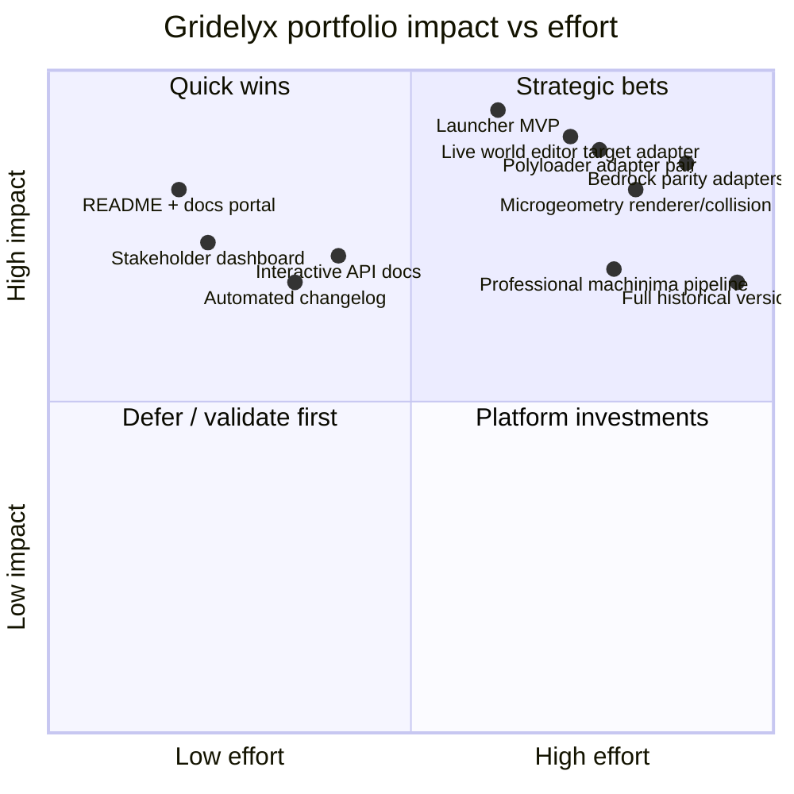

# Gridelyx impact-effort matrix

Impact-effort analysis is a **diagnostic for sequencing**, not a scope-deletion mechanism. Retained CR requirements remain until explicitly superseded.

Source: `diagrams/impact-effort.mmd`.

## Scoring model

Use 0.0–1.0 scores and record assumptions in the Feature Decision Packet.

**Impact** considers user reach, critical-path unlocks, risk reduction, evidence gained, architectural reuse and strategic differentiation.

**Effort** considers engineering time, maintenance burden, target/version fragmentation, external dependencies, testing matrix, security blast radius and migration/rollback cost.

Scores are deliberately approximate until measured. A high-effort/high-impact feature is a strategic bet, not a rejection candidate.

## Review cadence

Re-score after major target-version changes, MVP evidence, new loader/Bedrock APIs, benchmark discoveries, critical-path changes or a Feature Decision Packet that materially changes cost/risk assumptions.
