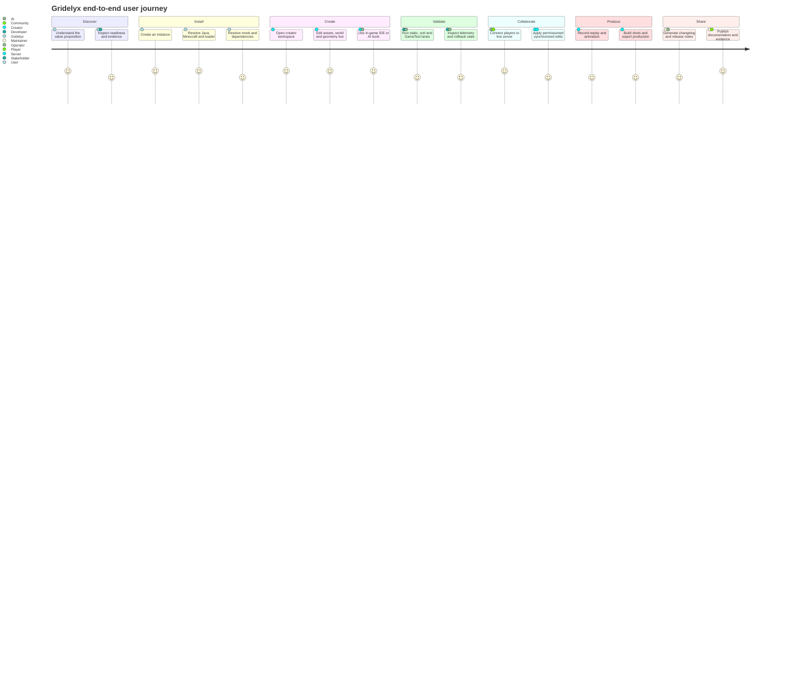

# Gridelyx user journey mapping

User journeys are product-planning tools. They describe intended experience and handoffs; they do not promote runtime readiness.

## Primary journey

Source: `diagrams/user-journey.mmd`.

## Personas and success criteria

| Persona | Wants | Failure mode to avoid | Success evidence |
|---|---|---|---|
| Player | Install and play without dependency archaeology | broken instance / unexplained conflict | deterministic resolution + clean launch |
| Mod creator | fast code/content iteration | restart-heavy workflow and opaque errors | live reload where valid + targeted diagnostics |
| World builder | edit generated worlds while players are connected | corruption, desync, lighting/chunk breakage | transactional mutation + reconciliation + rollback |
| Technical artist | create custom geometry/assets in context | static-export loop with poor preview fidelity | live asset/mesh preview + renderer evidence |
| Server operator | safe collaborative editing | client authority or tick stalls | permissioned server authority + culling/budgets |
| AI/tool developer | control the environment through stable contracts | raw unrestricted memory/input automation | MCP/capability APIs + bounded permissions |
| Filmmaker | animate, record and reproduce scenes | nondeterministic takes and weak timing | rational timeline + replay/capture metadata |
| Maintainer | know what is actually ready | architecture docs mistaken for shipped support | R0-R6 evidence + release-note provenance |

## Journey instrumentation targets

Future telemetry should measure completion/error time for instance creation, dependency resolution, first creator edit, hotload, transaction rollback, multiplayer synchronization, capture/export and documentation discovery. Metrics must be privacy-aware and opt-in where user telemetry leaves the local machine.
