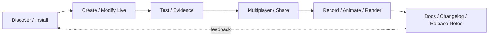

# Gridelyx Studio

## Value proposition

- **One cross-edition creation platform:** launcher, dependency resolver, Polyloader/UAL, world editing, live assets, scripts/native bridges, Java/Bedrock adapters and production tooling use one capability/evidence model.
- **Develop inside the living game:** Gridelyx targets in-game editing, IDE/AI control, hotload, transactional world mutation and multiplayer-aware authoring so iteration does not default to restart-and-alt-tab loops.
- **Evidence-first ambition:** requirements, versions, dependencies, risks, rollback and R0-R6 validation remain visible so vision is never presented as shipped support without proof.

## Choose your view

| You are… | Start here |
|---|---|
| Stakeholder / collaborator | [Stakeholder Dashboard](STAKEHOLDER_DASHBOARD.md) |
| Player / evaluator | [Project Overview](PROJECT_OVERVIEW.md) |
| Contributor | [Contributor Onboarding](community/CONTRIBUTOR_ONBOARDING.md) |
| Mod developer | [Dependencies & Toolchain](DEPENDENCIES_AND_TOOLCHAIN.md), then [AI Modding Reference Corpus](AI_MODDING_REFERENCE_CORPUS.md) |
| Architect | [Architecture Diagrams](ARCHITECTURE_DIAGRAMS.md) |
| Feature owner | [Feature Decision Framework](FEATURE_DECISION_FRAMEWORK.md) |
| API/tool developer | [Interactive API Documentation](api/index.md) |
| Maintainer | [Roadmap](ROADMAP.md), [TODO](TODO.md), [Release Communications](RELEASE_NOTES_AND_CHANGELOGS.md), [Linking Policy](LINKING_POLICY.md) |
| AI agent | root [`AGENTS.md`](../AGENTS.md), [`AI_HANDOFF.md`](../AI_HANDOFF.md), [`ai/README.md`](../ai/README.md), then the target skill/reference manifest |

## Dependency and reference architecture

Gridelyx does not need to vendor Minecraft, NeoForge, the MDK, JDK/Gradle distributions or Maven dependency payloads in order to remain reproducible or AI-readable.

Use these layers:

- **Human dependency inventory:** [Dependencies & Toolchain](DEPENDENCIES_AND_TOOLCHAIN.md) and [Capability Dependency Matrix](CAPABILITY_DEPENDENCY_MATRIX.md).
- **Human + AI reference guide:** [AI Modding Reference Corpus](AI_MODDING_REFERENCE_CORPUS.md).
- **Documentation navigation rule:** [Linking Policy](LINKING_POLICY.md).
- **Machine-readable versions:** [`../platform/versions.json`](../platform/versions.json).
- **Machine-readable prerequisites:** [`../platform/toolchain-requirements.json`](../platform/toolchain-requirements.json).
- **Machine-readable reference/source routing:** [`../platform/reference-sources.json`](../platform/reference-sources.json).
- **Acquisition/provenance policy:** [`../vault/manifest.json`](../vault/manifest.json).
- **Target AI skill:** [`../ai/skills/neoforge-26.2-mod-development/SKILL.md`](../ai/skills/neoforge-26.2-mod-development/SKILL.md).

Official/open-source references may be hydrated into ignored `.reference-cache/` state and indexed locally for RAG/agent use. Minecraft development sources resolved/generated by the supported toolchain remain local-only reference material rather than public repository content.

## Current visual map

The detailed system diagram is in [Architecture Diagrams](ARCHITECTURE_DIAGRAMS.md). Current readiness is in [Feature Map](FEATURE_MAP.md); retained scope is in [Chat Requirements Traceability](CHAT_REQUIREMENTS_TRACEABILITY.md).
